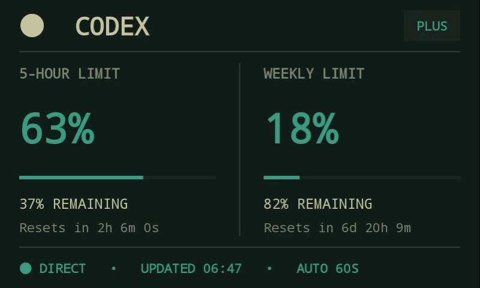
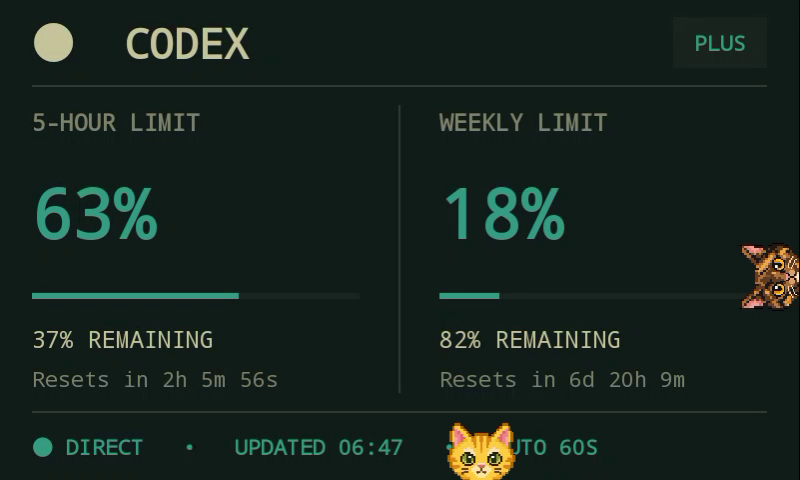
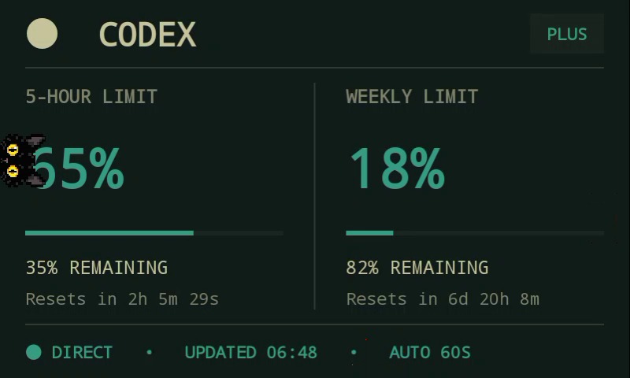

# Codex Meter for Xiaomi X04G

A lightweight Android usage display for the Xiaomi X04G smart speaker.

Codex Meter connects directly to your Codex account and shows your current usage limits on the device screen.

## Demo







## Features

* **Live Codex usage**

  * Displays the current **5-hour usage limit**
  * Displays the current **weekly usage limit**
  * Refreshes automatically every **60 seconds**
  * Shows remaining usage and reset countdowns

* **Pixel cats**

  * Three pixel-art cats randomly peek into the screen from the edges

## Hardware Requirements

* A **Xiaomi X04G** smart speaker
* The device must already be **unlocked**
* If you are using the **Chinese domestic version**, it must be flashed with the **international firmware** before installing Codex Meter

The goal is to turn the Xiaomi X04G into a small always-on Codex usage display, with a little personality added by the cats.

## What the app shows

The meter displays:

* 5-hour and weekly usage limits
* Remaining usage and reset countdowns
* ChatGPT plan and last update time
* Offline state with the last successful reading retained

The Android app connects directly to ChatGPT over Wi-Fi every 60 seconds. Its independent OAuth session is encrypted with the Android Keystore and stored in the app-private directory; the APK and repository never contain credentials.

## Pixel cats

The three pixel-art cats occasionally peek from the top, bottom, left, or right edge of the 800×480 display. They enter and retreat independently, blink one to three times, and never overlap. Their runtime sprites use crisp nearest-neighbor scaling and transparent backgrounds.

## Build

```bash
./gradlew assembleDebug
```

The APK is generated at `app/build/outputs/apk/debug/app-debug.apk`.

## Install and configure

Install the debug APK on the connected X04G:

```bash
adb install -r app/build/outputs/apk/debug/app-debug.apk
```

Create the device authentication file with:

```bash
python3 device_auth.py
```

Then copy the generated credentials into the app's private storage:

```bash
adb shell run-as com.gengyixiong.codexmeter sh -c 'cat > files/auth.json' \
  < /tmp/codex-meter-device-auth.json
adb shell am force-stop com.gengyixiong.codexmeter
adb shell monkey -p com.gengyixiong.codexmeter 1
```

Follow the device-login instructions printed by `device_auth.py`. After the app imports the file, it deletes the plaintext copy from its private directory. Delete `/tmp/codex-meter-device-auth.json` after installation.

Select Codex Meter as the Home app if you want the device to boot directly into the meter.

## Tests

Run the Android unit tests and build checks with:

```bash
./gradlew test
```

The focused tests cover cat rotation, spawn probabilities, color uniqueness, blink schedules, corner-safe placement, and cross-edge collision spacing.
